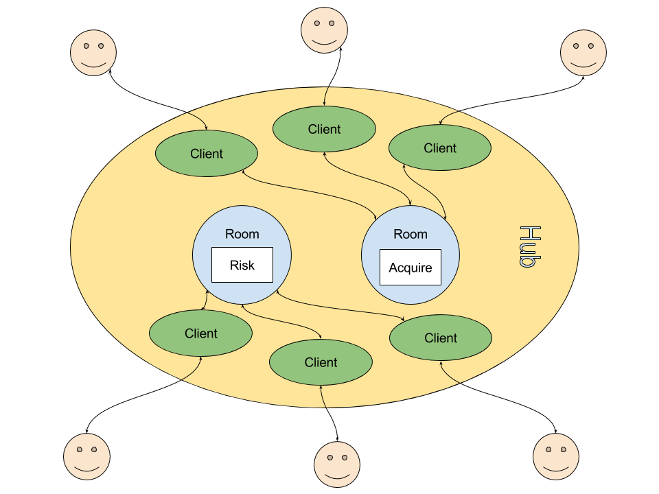

# Sackson Server

A websocket-driven server written in Go, which allows to play games that implement a bridge interface through message passing between
connected clients and game's logic.

## Architecture

## Messages

As stated at the beginning, Sackson server communicates with its different elements (game bridges, clients and rooms) through
message passing, managed by a structure called Hub. Those messages are in JSON format, and are divided between incoming messages
(from a client to the Hub) and outgoing ones (from the Hub to one or multiple clients).

Incoming messages communicate actions that a user wants to perform and can be
categorized between hub messages, room messages and game-specific ones.

The flow for incoming messages goes outside in: First the hub parses the incoming message type, if it should be managed by the hub itself it does it, otherwise the message is passed to the game room the client is currently into. Again, the game room parses the message type and if it is not of a type recognized by the room struct, passes it again, this time to the game bridge.

On the other hand, outgoing messages are sent to one or multiple clients to communicate events, usually in response to user actions.

#### Hub level messages

These messages describe server-wide operations, basically game room creation/destroying.

You can check them out at [interfaces/incoming_messages_hub.go](interfaces/incoming_messages_hub.go).

#### Room level messages

The following are the actions that can be executed in a room, and therefore the types of messages it can manage.
Note that room level messages do not need to specify a room ID because a player
can only be in one room at a time, and the system tracks it.

You can check them out at [interfaces/incoming_messages_room.go](interfaces/incoming_messages_room.go).

#### Game level messages

If a message does not fall into any of the above two categories, it is considered to be a game-specific message and thus will be managed by
the room game bridge. Check the bridge documentation for information regarding its messages.

## Installation

### Requirements
* [Docker & Docker-compose](docker.com).

### Installation steps

* `git clone github.com/svera/sackson-server`
* Create a configuration file called `sackson-server` and place it in the source code folder. Use `sackson.sample.yml` as reference.
* Build image: `docker-compose build sackson-server`
* Recreate container:
  * Development: `docker-compose up`. Add `-d` at the end if you want to run the container in detached mode. Sackson-server will be automatically rebuilt and rerun if there are changes in the source code, thanks to [Fresh](github.com/pilu/fresh).
  * Production: `docker-compose -f docker-compose.yml -f docker-compose.prod.yml up`. Add `-d` at the end if you want to run the container in detached mode.

### Deployment in a production environment

Currently we're following [this guide](https://docs.docker.com/compose/production) to do production deployments. Basicly:
* Update source code: `git pull origin master`.
* Rebuild image: `docker-compose build sackson-server`.
* Recreate container: `docker-compose -f docker-compose.yml -f docker-compose.prod.yml up`. Add `-d` at the end if you want to run the container in detached mode.

### Running tests

Just type `docker-compose run sackson-server govendor test +local` to run application tests.